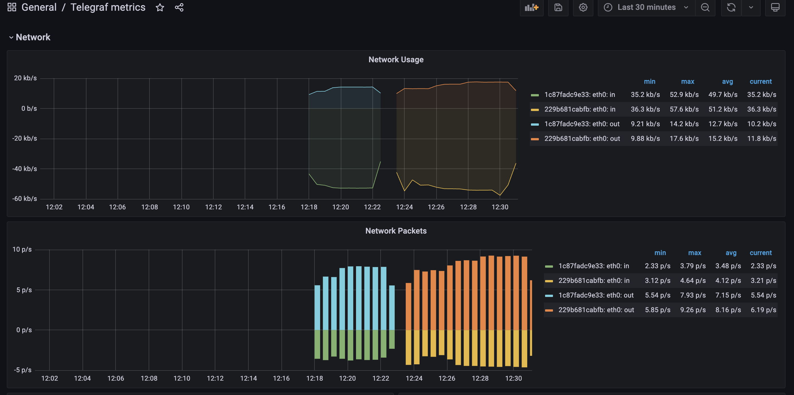
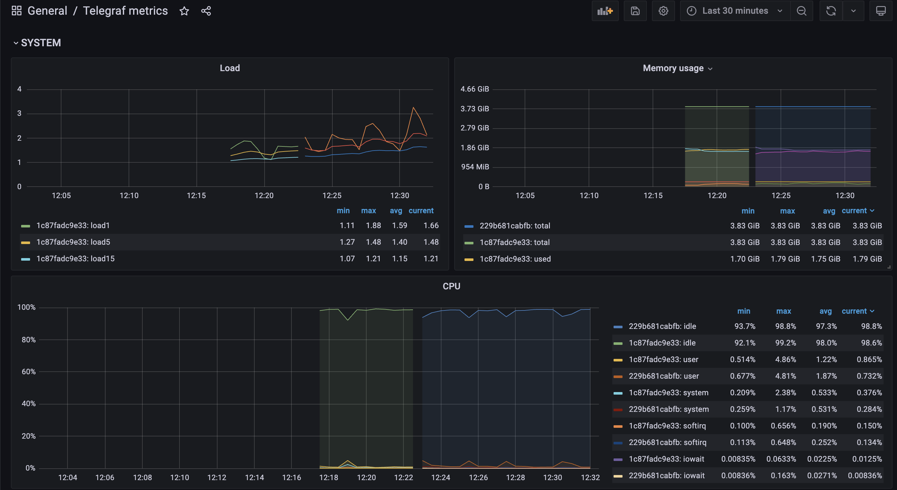
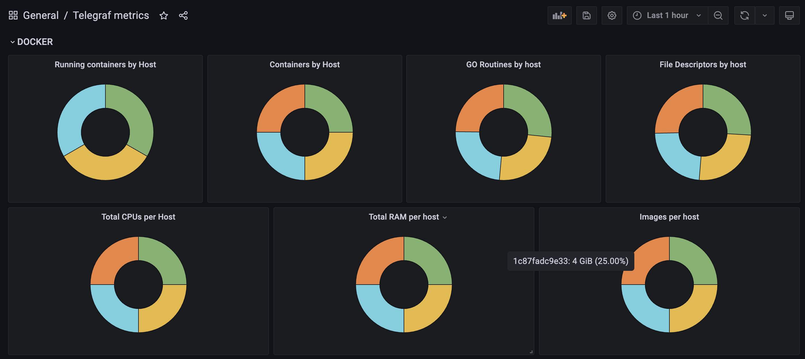
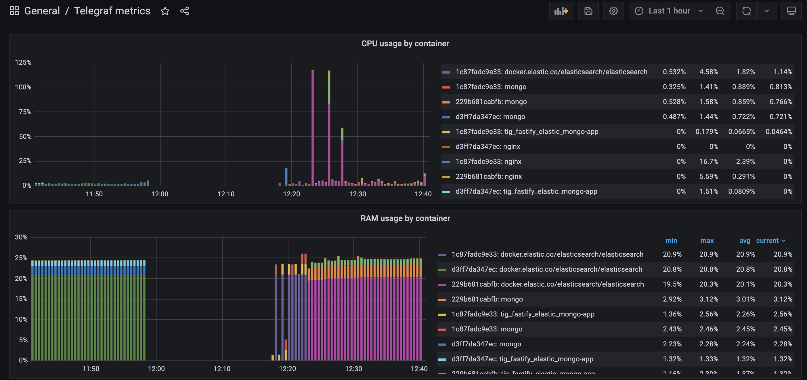
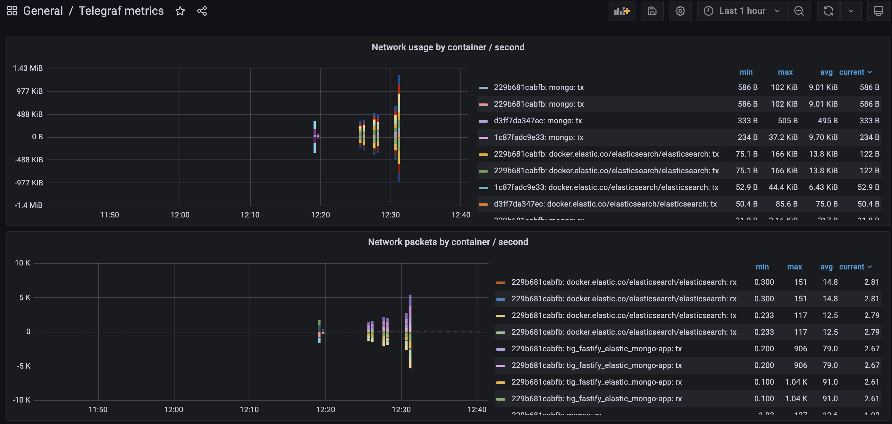
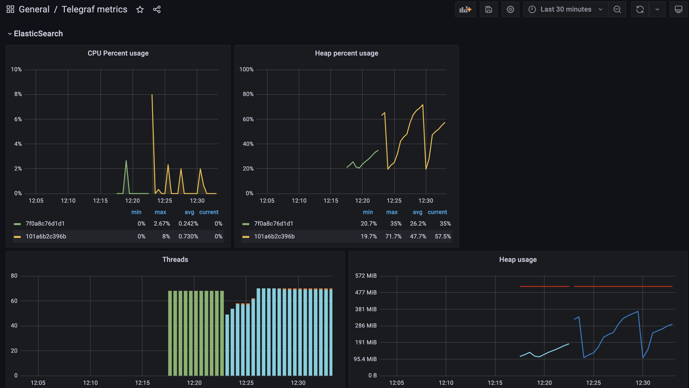
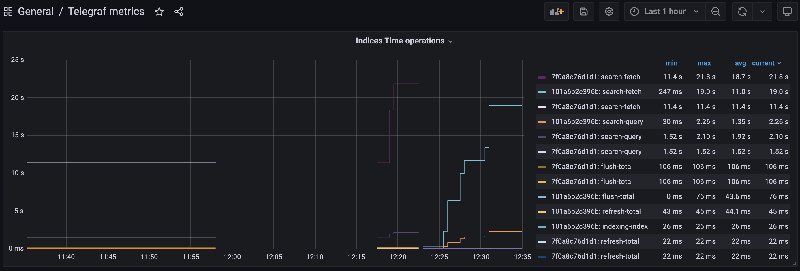
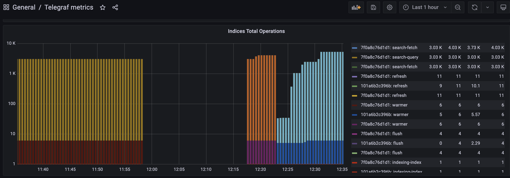
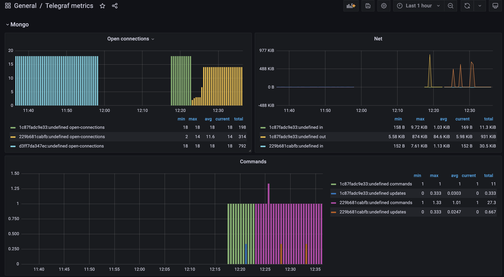
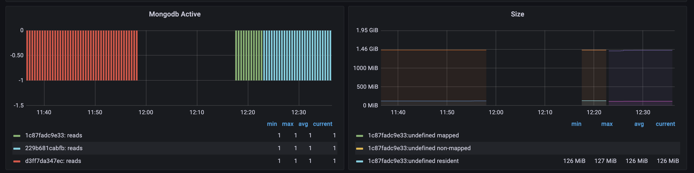

# Example Docker Compose project for Telegraf, InfluxDB, Grafana, Nginx, Fastify, MongoDb and Elasticsearch

This an example project to show the TIG (Telegraf, InfluxDB and Grafana) stack with Fatify application, MongoDB, ElasticSearch and Nginx.

## Start the stack with docker compose

```bash
$ docker-compose up
```

## Services and Ports

### Grafana
- URL: http://localhost:3001
- User: admin 
- Password: admin 

### Telegraf
- Port: 8125 UDP (StatsD input)

### InfluxDB
- Port: 8086 (HTTP API)
- User: admin 
- Password: admin 
- Database: influx

### MongoDB 
- Port: 27017
- DB: HSA_DB

### Elasticsearch
- Port:9200
- Index: movies

## Generate Load
```
cd app/scripts
node generateLoad.js
```

### Example of load metrics after generated load

Network


System


Docker




Elasticsearch




Mongo




## License

The MIT License (MIT). Please see [License File](LICENSE) for more information.

